# PartidosFutbol5

Una aplicación de escritorio en Java (Swing + Maven) para gestionar partidos de Fútbol-5, con registro y login de usuarios (jugadores y administrador), formación automática de equipos y persistencia en MySQL.

---

## Índice

1. [Descripción](#descripción)
2. [Tecnologías](#tecnologías)
3. [Estructura del Proyecto](#estructura-del-proyecto)
4. [Diagrama UML](#diagrama-uml)
5. [Configuración de la Base de Datos](#configuración-de-la-base-de-datos)
6. [Instalación y Ejecución](#instalación-y-ejecución)
7. [Componentes Principales](#componentes-principales)

   * [Modelo (MODELO)](#modelo-modelo)
   * [Vista (VISTA)](#vista-vista)
   * [Controlador (CONTROLADOR)](#controlador-controlador)
   * [Persistencia (Conexion)](#persistencia-conexion)
8. [Cómo Extender o Modificar](#cómo-extender-o-modificar)
9. [Licencia](#licencia)

---

## Descripción

Este proyecto permite a un **Administrador** crear y gestionar partidos de Fútbol-5, conformar equipos automáticamente según distintas **estrategias de reparto**, y persistir resultados en una base de datos MySQL. Los **Jugadores** pueden registrarse, iniciar sesión y consultar datos de su perfil, últimos partidos y sanciones pendientes.

---

## Tecnologías

* **Java 17+**
* **Swing** (Interfaz gráfica)
* **Maven** (Gestión de dependencias y compilación)
* **MySQL** (Persistencia de datos)
* **Mermaid** (Para documentar el UML)

---

## Estructura del Proyecto

```plaintext
PartidosFutbol5/
│
├── pom.xml
├── README.md
└── src
    ├── main
    │   ├── java
    │   │   ├── com.mycompany.partidosfutbol5
    │   │   │   └── PartidosFutbol5.java
    │   │   │
    │   │   ├── CONTROLADOR
    │   │   │   ├── ControladorLogIn.java
    │   │   │   ├── RegistroController.java
    │   │   │   ├── CrearPartidoController.java
    │   │   │   ├── PartidoActualController.java
    │   │   │   ├── AdministradorOpcionesController.java
    │   │   │   ├── ListaJugadoresController.java
    │   │   │   ├── SancionesPendientesController.java
    │   │   │   ├── JugadorOpcionesController.java
    │   │   │   ├── PartidoActualControllerJugador.java
    │   │   │   ├── UltimoPartidoController.java
    │   │   │   └── PerfilJugadorController.java
    │   │   │
    │   │   ├── MODELO
    │   │   │   ├── Usuario.java
    │   │   │   ├── Jugador.java
    │   │   │   ├── Administrador.java
    │   │   │   ├── Calificacion.java
    │   │   │   ├── Partido.java
    │   │   │   ├── EquipoRojo.java
    │   │   │   ├── EquipoAzul.java
    │   │   │   ├── Formaciones.java
    │   │   │   ├── ReparticionEquipos.java
    │   │   │   ├── ReparticionImparPar.java
    │   │   │   ├── ReparticionDefinida.java
    │   │   │   ├── AlgoritmoFormacion.java
    │   │   │   ├── PorPromedioGeneral.java
    │   │   │   ├── PorUltimoPartido.java
    │   │   │   ├── SancionesPendientes.java
    │   │   │   ├── Notificador.java
    │   │   │   ├── Singleton.java
    │   │   │   ├── Conexion.java
    │   │   │   └── Partidos.java
    │   │   │
    │   │   └── VISTA
    │   │       └── InicioSesion
    │   │           ├── LogInVista.java
    │   │           └── RegistroVista.java
    │   │       └── Administrador
    │   │           ├── AdministradorOpcionesVista.java
    │   │           ├── CrearPartidoVista.java
    │   │           ├── PartidoActualVista.java
    │   │           ├── ListaJugadoresVista.java
    │   │           ├── SancionesPendientesVista.java
    │   │           ├── JugadorOpcionesVista.java
    │   │           ├── PartidoActualVistaJugador.java
    │   │           ├── UltimoPartidoVista.java
    │   │           └── PerfilJugadorVista.java
    │   │
    └── resources
        └── VISTA
            └── InicioSesion
                └── logo5.png
```

---

## Diagrama UML

El siguiente diagrama resume la arquitectura MVC, las entidades del dominio y las estrategias de reparto:

```mermaid
%%{init: { "theme": "redux" }}%%
classDiagram

    %% 1. Vistas y Controladores
    class LogInVista {
      +mostrarFormulario(): void
      +mostrarError(msg: String): void
    }
    class LogInController {
      -view: LogInVista
      -session: Singleton
      +onLoginButtonPressed(usuario: String, clave: String): void
    }
    class RegistroVista {
      +mostrarFormulario(): void
      +mostrarError(msg: String): void
    }
    class RegistroController {
      -view: RegistroVista
      -session: Singleton
      +onRegisterButtonPressed(data: RegistroData): void
    }
    LogInController --> LogInVista : usa
    LogInController --> RegistroController
    RegistroController --> RegistroVista : usa

    %% 2. Singleton de Sesión
    class Singleton {
      -instance: Singleton
      -currentUser: Usuario
      +getInstance(): Singleton
      +getUsuario(): Jugador
      +getAdministrador(): Administrador
    }
    LogInController --> Singleton
    RegistroController --> Singleton

    %% 3. Interfaz Usuario
    class Usuario {
      <<interface>>
      +login(): boolean
    }
    Singleton ..> Usuario
    LogInController --> Usuario
    Usuario <|.. Jugador
    Usuario <|.. Administrador
    RegistroController --> Jugador : crea

    %% 4. Roles del Sistema
    class Jugador {
      -nombre: String
      -frecuente: boolean
      -modo: ModoParticipacion
      -infracciones: int
      -calificaciones: List<Calificacion>
      -calificacionPromedio: float
      -calificacionUltimoPartido: float
      +getPromedio(): float
      +estaPenalizado(): boolean
    }
    class Administrador {
      +crearPartido(): Partido
      +generarEquipos(p: Partido, algoritmo: AlgoritmoFormacion): void
      +sancionar(j: Jugador): void
      +quitarInfraccion(j: Jugador): void
      +confirmarPartido(p: Partido): void
    }

    %% 5. Listado de Jugadores
    class ListaJugadores {
      +getJugadores(): List<Jugador>
      +getFrecuentes(topN: int): List<Jugador>
    }
    class ListaJugadoresController {
      +cargarJugadores(): void
      +calcularPromedios(): void
    }
    class ListaJugadoresVista {
      +mostrarJugadores(list: List<Jugador>): void
    }
    ListaJugadoresController --> ListaJugadoresVista : usa
    ListaJugadoresController --> ListaJugadores : consulta
    AdministradorOpcionesController --> ListaJugadoresController

    %% 6. Calificaciones
    class Calificacion {
      -puntuacion: int
      -comentario: String
      -autor: Jugador
      +getPuntuacion(): int
    }
    Jugador "1" --> "*" Calificacion : recibe
    Calificacion "*" --> "1" Jugador : autor

    %% 7. Creación y Gestión de Partido
    class CrearPartidoController {
      -view: CrearPartidoVista
      -fecha: Date
      -confirmado: boolean
      -jugadores: List<Jugador>
      -equipoRojo: EquipoRojo
      -equipoAzul: EquipoAzul
      +elegirFormacion(formId: String): void
      +preConfirmar(): void
      +generarReparto(): void       <<usa ReparticionEquipos>>
      +registrarInasistencia(j: Jugador): void
      +guardarPartido(): void       <<registra en Partidos>>
    }
    class PartidoActualVista {
      +mostrarPartidoCreado(): void
    }
    class PartidoActualController {
      -view: PartidoActualVista
      +modificarJugadores(): void
      +confirmarPartido(): void
    }
    CrearPartidoController --> ReparticionEquipos : usa
    CrearPartidoController --> Partidos : guarda
    AdministradorOpcionesController --> PartidoActualController
    PartidoActualController --> PartidoActualVista : usa

    %% 9. Estrategias de Reparto
    class ReparticionEquipos {
      <<interface>>
      +repartir(formacion: Formaciones, lista: ListaJugadores): (EquipoRojo, EquipoAzul)
    }
    class ReparticionImparPar {
      +repartir(formacion: Formaciones, lista: ListaJugadores): (EquipoRojo, EquipoAzul)
    }
    class ReparticionDefinida {
      +repartir(formacion: Formaciones, lista: ListaJugadores): (EquipoRojo, EquipoAzul)
    }
    ReparticionEquipos <|.. ReparticionImparPar
    ReparticionEquipos <|.. ReparticionDefinida
    ReparticionEquipos --> ListaJugadores : ordena por Calificacion (asc)
    ReparticionEquipos --> Formaciones : usa plantilla

    %% 8. Opciones de Administrador
    class AdministradorOpcionesController {
      +mostrarMenu(): void
    }
    class AdministradorOpcionesVista {
      +mostrarOpciones(): void
    }
    Administrador --> AdministradorOpcionesController
    AdministradorOpcionesController --> AdministradorOpcionesVista : usa
    AdministradorOpcionesController --> CrearPartidoController

    %% 10. Algoritmo de Formación
    class AlgoritmoFormacion {
      <<interface>>
      +formarEquipos(jugadores: List<Jugador>): List<Equipo>
    }
    AlgoritmoFormacion --> ListaJugadores : consulta
    class PorPromedioGeneral
    class PorUltimoPartido
    AlgoritmoFormacion <|.. PorPromedioGeneral
    AlgoritmoFormacion <|.. PorUltimoPartido

    %% 11. Formaciones
    class Formaciones {
      -formacionesDisponibles: List<String>
      +getFormaciones(): List<String>
      +addFormacion(name: String): void
    }

    %% 12. Sanciones Pendientes
    class SancionesPendientesController {
      +jugadoresSancionados(): List<Jugador>
    }
    class SancionesPendientesVista {
      +mostrarSanciones(list: List<Jugador>): void
    }
    AdministradorOpcionesController --> SancionesPendientesController
    SancionesPendientesController --> SancionesPendientesVista : usa

    %% 14. Modos y Enumeraciones
    class ModoParticipacion {
      <<enum>>
      ESTANDAR
      SOLIDARIO
    }
    Jugador --> ModoParticipacion

    %% 15. Persistencia de Partidos
    class Partidos {
      -partidoId: UUID
      -fecha: Date
      -equipoRojo: EquipoRojo
      -equipoAzul: EquipoAzul
      -resultadoRojo: int
      -resultadoAzul: int
      +save(): void
      +findById(id: UUID): Partidos
    }
    Partidos --> EquipoRojo
    Partidos --> EquipoAzul

    %% 16. Opciones de Jugador
    class JugadorOpcionesController {
      +mostrarMenu(): void
    }
    class JugadorOpcionesVista {
      +mostrarOpciones(): void
    }
    JugadorOpcionesController --> JugadorOpcionesVista : usa
    JugadorOpcionesController --> PartidoActualControllerJugador
    JugadorOpcionesController --> UltimoPartidoController
    JugadorOpcionesController --> PerfilJugadorController
    Jugador --> JugadorOpcionesController

    %% 17. Partido Actual Jugador
    class PartidoActualControllerJugador
    class PartidoActualVistaJugador
    PartidoActualControllerJugador --> PartidoActualVistaJugador : usa

    %% 17. Último Partido
    class UltimoPartidoController
    class UltimoPartidoVista
    UltimoPartidoController --> UltimoPartidoVista : usa

    %% 18. Perfil Jugador
    class PerfilJugadorController
    class PerfilJugadorVista
    PerfilJugadorController --> PerfilJugadorVista : usa
```



---

## Configuración de la Base de Datos

1. Crea la base de datos `futbol5db` (o ajústala a tu nombre preferido).
2. Ejecuta el siguiente script SQL para crear las tablas necesarias:

   ```sql
   -- 1. Tabla USUARIO
   CREATE TABLE USUARIO (
       usuario_id    INT            AUTO_INCREMENT PRIMARY KEY,
       username      VARCHAR(50)    NOT NULL UNIQUE,
       password_hash VARCHAR(255)   NOT NULL,
       tipo_usuario  CHAR(1)        NOT NULL        -- 'J' = Jugador, 'A' = Administrador
   );

   -- 2. Tabla JUGADOR
   CREATE TABLE JUGADOR (
       jugador_id               INT             PRIMARY KEY,
       nombre                   VARCHAR(100)    NOT NULL,
       frecuente                BOOLEAN         NOT NULL DEFAULT FALSE,
       modo_participacion       ENUM('ESTANDAR','SOLIDARIO') NOT NULL,
       infracciones             INT             NOT NULL DEFAULT 0,
       calificacion_promedio    DECIMAL(5,2)    NOT NULL DEFAULT 0.00,
       calificacion_ultimo_part INT             NOT NULL DEFAULT 0,
       CONSTRAINT fk_jugador_usuario
         FOREIGN KEY (jugador_id) REFERENCES USUARIO(usuario_id)
         ON DELETE CASCADE
         ON UPDATE CASCADE
   );

   -- 3. Tabla ADMINISTRADOR
   CREATE TABLE ADMINISTRADOR (
       administrador_id INT PRIMARY KEY,
       CONSTRAINT fk_admin_usuario
         FOREIGN KEY (administrador_id) REFERENCES USUARIO(usuario_id)
         ON DELETE CASCADE
         ON UPDATE CASCADE
   );

   -- 4. Tabla CALIFICACION
   CREATE TABLE CALIFICACION (
       calificacion_id INT           AUTO_INCREMENT PRIMARY KEY,
       puntuacion      INT           NOT NULL CHECK (puntuacion BETWEEN 0 AND 10),
       comentario      VARCHAR(255)  NULL,
       autor_id        INT           NOT NULL,
       CONSTRAINT fk_calificacion_autor
         FOREIGN KEY (autor_id) REFERENCES JUGADOR(jugador_id)
         ON DELETE CASCADE
         ON UPDATE CASCADE
   );

   -- 5. Tabla FORMACIONES
   CREATE TABLE FORMACIONES (
       formacion_id           INT            AUTO_INCREMENT PRIMARY KEY,
       nombre_formacion       VARCHAR(50)    NOT NULL UNIQUE
   );

   -- 6. Tabla PARTIDO
   CREATE TABLE PARTIDO (
       partido_id       INT            AUTO_INCREMENT PRIMARY KEY,
       fecha_partido    DATETIME       NOT NULL,
       formacion_id     INT            NOT NULL,
       resultado_rojo   INT            DEFAULT 0,
       resultado_azul   INT            DEFAULT 0,
       confirmado       BOOLEAN        NOT NULL DEFAULT FALSE,
       CONSTRAINT fk_partido_formacion
         FOREIGN KEY (formacion_id) REFERENCES FORMACIONES(formacion_id)
         ON DELETE RESTRICT
         ON UPDATE CASCADE
   );

   -- 7. Tabla EQUIPO
   CREATE TABLE EQUIPO (
       equipo_id      INT            AUTO_INCREMENT PRIMARY KEY,
       partido_id     INT            NOT NULL,
       tipo_equipo    ENUM('ROJO','AZUL') NOT NULL,
       CONSTRAINT fk_equipo_partido
         FOREIGN KEY (partido_id) REFERENCES PARTIDO(partido_id)
         ON DELETE CASCADE
         ON UPDATE CASCADE
   );

   -- 8. Tabla EQUIPO_JUGADOR
   CREATE TABLE EQUIPO_JUGADOR (
       equipo_id   INT NOT NULL,
       jugador_id  INT NOT NULL,
       PRIMARY KEY (equipo_id, jugador_id),
       CONSTRAINT fk_eqj_equipo
         FOREIGN KEY (equipo_id) REFERENCES EQUIPO(equipo_id)
         ON DELETE CASCADE
         ON UPDATE CASCADE,
       CONSTRAINT fk_eqj_jugador
         FOREIGN KEY (jugador_id) REFERENCES JUGADOR(jugador_id)
         ON DELETE CASCADE
         ON UPDATE CASCADE
   );
   ```

---

## Instalación y Ejecución

1. **Clonar el repositorio**

   ```bash
   git clone https://github.com/tu_usuario/PartidosFutbol5.git
   cd PartidosFutbol5
   ```

2. **Configurar MySQL**

   * Asegúrate de que MySQL esté en ejecución y que exista la base `futbol5db`.
   * Ejecute el script anterior para crear las tablas.

3. **Añadir el logo en recursos**

   * Copia `logo5.png` (sin fondo, color verde 0,102,51) a `src/main/resources/VISTA/InicioSesion/`.

4. **Compilar con Maven**

   ```bash
   mvn clean compile
   ```

5. **Ejecutar la aplicación**

   ```bash
   mvn exec:java -Dexec.mainClass="com.mycompany.partidosfutbol5.PartidosFutbol5"
   ```

   O, alternativamente, desde NetBeans:

   * **Clean and Build** → **Run Project**.

6. **Primer Login (Administrador por defecto)**

   * Inserta manualmente (en MySQL) un registro en `USUARIO` con `tipo_usuario='A'` y en `ADMINISTRADOR` con el mismo `usuario_id`.
   * Luego abre la app, escribe las credenciales y deberías ingresar como administrador.

---

## Componentes Principales

### 1. Modelo (MODELO)

* **Usuario (interface)**
  Define el método `login()`.
* **Jugador**

  * Campos: `id`, `nombre`, `frecuente`, `modo`, `infracciones`, `calificaciones`, `calificacionPromedio`, `calificacionUltimoPartido`.
  * Métodos: `getPromedio()`, `estaPenalizado()`, `addCalificacion(...)`, `addInfraccion()`.
* **Administrador**

  * Métodos: `crearPartido()`, `generarEquipos(...)`, `sancionar(...)`, `quitarInfraccion(...)`, `confirmarPartido(...)`.
* **Calificacion**

  * Campos: `puntuacion`, `comentario`, `autor`.
  * Método: `getPuntuacion()`.
* **Partido**

  * Campos: `partidoId`, `fecha`, `confirmado`, `formacion`, `jugadores`, `equipoRojo`, `equipoAzul`, `resultadoRojo`, `resultadoAzul`.
  * Métodos: `agregarJugador(...)`, `registrarInasistencia(...)`, `confirmar()`, `equiposAsignados()`.
* **EquipoRojo / EquipoAzul**

  * Listas de `Jugador` y método `agregarJugador(...)`.
* **Formaciones**

  * Mantiene un listado de plantillas (e.g., "3-2", "4-1").
* **ReparticionEquipos (interface)**

  * `repartir(formacion, listaJugadores)`.
* **ReparticionImparPar / ReparticionDefinida**

  * Implementan `ReparticionEquipos`, usan `Formaciones` y `ListaJugadores`.
* **AlgoritmoFormacion (interface)**

  * `formarEquipos(listaJugadores)`.
* **PorPromedioGeneral / PorUltimoPartido**

  * Implementan `AlgoritmoFormacion`, ordenan `ListaJugadores` según calificaciones.
* **SancionesPendientes**

  * Consultas a la lista de `Jugador` con `infracciones >= 2`.
* **Notificador (interface)**

  * `enviarCorreo(...)` para notificar a jugadores.
* **Singleton**

  * Mantiene la sesión del usuario autenticado.
* **Conexion**

  * Conexión JDBC a MySQL.
  * Métodos: `ingresar()`, `cargarDatosJugador(...)`, `cargarDatosAdministrador(...)`, `registrarJugador(...)`, `guardarPartido(...)`, `obtenerJugadorPorId(...)`, `obtenerPartidoPorId(...)`.
* **Partidos**

  * Abstracción de la tabla `PARTIDO` con métodos `save()` y `findById(...)`.

### 2. Vista (VISTA)

* **LogInVista**

  * Formulario Swing con `JTextField` (usuario), `JPasswordField` (clave), botones “Ingresar” y “Nuevo Usuario”.
* **RegistroVista**

  * Formulario Swing para registrar un nuevo jugador (nombre, username, password, modo de participación, etc.).
* **AdministradorOpcionesVista**

  * Menú principal del admin con opciones (“Crear Partido”, “Lista Jugadores”, “Sanciones Pendientes”, etc.).
* **CrearPartidoVista**

  * Permite seleccionar fecha, formación y lista de jugadores para un nuevo partido.
* **PartidoActualVista**

  * Muestra los detalles del partido creado y sus equipos.
* **ListaJugadoresVista**

  * Tabla o lista Swing con todos los jugadores y sus promedios.
* **SancionesPendientesVista**

  * Lista de jugadores que tienen `infracciones >= 2`.
* **JugadorOpcionesVista**

  * Menú para jugador (ver perfil, último partido, inscribir en partido, etc.).
* **PartidoActualVistaJugador**

  * Para que el jugador vea el partido al que está inscrito.
* **UltimoPartidoVista**

  * Muestra los resultados de su último partido.
* **PerfilJugadorVista**

  * Muestra nombre, calificación promedio, infracciones, etc.

### 3. Controlador (CONTROLADOR)

* **ControladorLogIn**

  * Maneja eventos de login y abre la vista de registro.
* **RegistroController**

  * Gestiona el alta de nuevos jugadores mediante `Conexion.registrarJugador(...)`.
* **CrearPartidoController**

  * Orquesta la creación de partidos: elige formación, invoca `ReparticionEquipos`, asigna `EquipoRojo` y `EquipoAzul`, y luego llama a `Conexion.guardarPartido(...)`.
* **PartidoActualController**

  * Permite modificar jugadores antes de confirmar y llama a `confirmarPartido()`.
* **AdministradorOpcionesController**

  * Control del menú de opciones del admin; redirige a los distintos sub-controladores (CrearPartido, ListaJugadores, SancionesPendientes).
* **ListaJugadoresController**

  * Carga la lista de jugadores desde `ListaJugadores` (o `Conexion`) y calcula promedios.
* **SancionesPendientesController**

  * Obtiene la lista de jugadores sancionados para mostrarla.
* **JugadorOpcionesController**

  * Controla el menú del jugador: inscribirse en partido, ver perfil, etc.
* **PartidoActualControllerJugador**, **UltimoPartidoController**, **PerfilJugadorController**

  * Controladores especializados para las vistas del jugador.

### 4. Persistencia (Conexion)

* Se conecta a MySQL (`jdbc:mysql://localhost:3306/futbol5db`).
* Autentica contra la tabla **USUARIO** y carga datos en `Singleton`.
* Registra nuevos jugadores y partidos (tablas: `USUARIO`, `JUGADOR`, `ADMINISTRADOR`, `PARTIDO`, `EQUIPO`, `EQUIPO_JUGADOR`).

---

## Cómo Extender o Modificar

1. **Añadir nuevos campos a `Jugador` o `Administrador`**

   * Modifica la tabla en la BD, ajusta las clases Java (`Jugador.java` o `Administrador.java`) y actualiza `Conexion.cargarDatosJugador(...)` o `cargarDatosAdministrador(...)`.

2. **Nueva estrategia de reparto**

   1. Crear una clase en `MODELO` que implemente `ReparticionEquipos` (p.ej. `ReparticionPorEdad`).
   2. En `CrearPartidoVista`, agregar opción para seleccionar esa estrategia.
   3. En `CrearPartidoController.generarReparto()`, instanciarla y llamar a `repartir(formacion, listaJugadores)`.

3. **Agregar campos a la tabla `PARTIDO` (por ejemplo, local, árbitro)**

   * Modificar el script SQL de la BD para incluir columnas nuevas.
   * Ajustar `Partido.java` con nuevos atributos y getters/setters.
   * Actualizar `Conexion.guardarPartido(...)` y `obtenerPartidoPorId(...)` para manejar los nuevos campos.

4. **Integrar un servicio de correo real**

   * Crear una implementación concreta de la interfaz `Notificador` (p.ej. `SMTPNotificador`).
   * Configurar credenciales SMTP en un archivo `config.properties` o similar.
   * Desde `Administrador`, invocar `Notificador.enviarCorreo(...)` al confirmar partido o sancionar.

5. **Cambiar a otro motor de base de datos**

   * Ajustar `obtenerConexion()` en `Conexion.java` para usar PostgreSQL, SQLite, etc.
   * Actualizar el driver en `pom.xml` (dependencia Maven) y la URL JDBC.

---

## Licencia

Este proyecto se distribuye bajo la licencia **MIT**.
Consulta el archivo [LICENSE](LICENSE) para más detalles.
